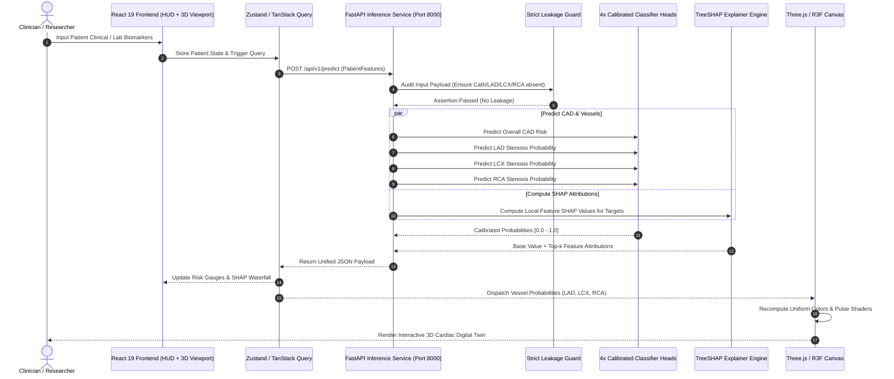

# Methodology & System Blueprint: Cardiovascular Risk Visualization & Prediction
**Track A: Multimodal AI Hackathon 2026**
**Document Version:** 1.0.0 | **Status:** Approved Architecture Specification  
**Roles:** Principal AI Systems Architect & Lead Full-Stack 3D Graphics Engineer

---

## 1. Executive Summary & Problem Formulation

Cardiovascular disease (CAD) remains the primary contributor to global mortality. While statistical predictive models can yield risk scores, raw numerical outputs fail to provide clinicians and patients with an intuitive, spatial understanding of how and where vascular pathology is developing.

This project delivers an end-to-end, real-time clinical decision support system combining:
1. **Multi-Target Gradient-Boosted Classification**: Predicting overall CAD status alongside vessel-specific stenosis probabilities across the three principal coronary arteries:
   - **LAD (Left Anterior Descending)**: Supplies the anterior myocardium and apex.
   - **LCX (Left Circumflex)**: Supplies the posterolateral left ventricle.
   - **RCA (Right Coronary Artery)**: Supplies the right ventricle, inferior wall, and sinoatrial/atrioventricular nodes.
2. **Strict Target Leakage Guardrails**: Enforcing mathematical and architectural exclusion of invasive catheterization (`Cath`) and ground-truth vessel stenosis features from input feature matrices across all training, validation, and inference phases.
3. **Local Explainability via TreeSHAP**: Extracting per-patient, per-vessel feature attribution vectors ($\phi_i$) to explain individual physiological and ECG drivers.
4. **Interactive 3D Anatomical WebGL Digital Twin**: Ingesting high-fidelity coronary glTF/GLB models into React Three Fiber (R3F), dynamically mapping calibrated stenosis probabilities $[0.0, 1.0]$ to GPU shader color uniforms and emissive ischemia indicators.
5. **Clinical Decision Support Safeguards**: Built-in FDA/CE SaMD Class IIa educational/decision-support boundary controls and interactive anatomical focal targeting.

---

## 2. System Architecture & Tech Stack Overview

### 2.1 Monorepo Directory Topology

The project is structured as an enterprise-grade monorepo isolating machine learning training, production REST inference, 3D WebGL rendering, and shared data contracts:

```
multimodal-cardiac-risk/
├── .cursorrules                         # AI pair-programming and code guardrails
├── .gitignore                           # Repository ignore configuration
├── package.json                         # Root workspace scripts & web dependencies
├── requirements.txt                     # Pinned Python 3.11+ dependencies
├── METHODOLOGY.md                       # Comprehensive system architecture & methodology
├── agents.md                            # Autonomous agent role specifications
├── skills.md                            # Operational execution recipes & runbooks
├── .github/
│   └── copilot-instructions.md          # Copilot / coding agent conventions
├── assets/
│   └── 3d/                              # Raw and Draco-compressed anatomical meshes
│       ├── raw/
│       │   └── heart_anatomy_source.gltf
│       ├── optimized/
│       │   ├── heart_coronary_optimized.glb
│       │   └── mesh_manifest.json       # Node hierarchy & material mapping
│       └── textures/                    # PBR normal/roughness maps (if applicable)
├── data/
│   ├── raw/
│   │   └── z_alizadeh_sani.csv          # UCI 303-record coronary dataset
│   ├── processed/
│   │   ├── X_features.parquet           # Cleaned, leakage-free feature matrix
│   │   ├── y_targets.parquet            # CAD, LAD, LCX, RCA binary targets
│   │   └── feature_metadata.json        # Categorical maps, scales, clinical ranges
│   └── validation/
│       └── test_cases_clinical.json     # Synthetic edge-case clinical fixtures
├── models/                              # Serialized model artifacts & explainers
│   ├── cad_model.joblib                 # Overall CAD calibrated classifier
│   ├── lad_model.joblib                 # LAD stenosis calibrated classifier
│   ├── lcx_model.joblib                 # LCX stenosis calibrated classifier
│   ├── rca_model.joblib                 # RCA stenosis calibrated classifier
│   ├── preprocessor.joblib              # ColumnTransformer (Scaling + OneHot)
│   ├── shap_explainers.joblib           # Pre-computed TreeSHAP explainers
│   └── model_metadata.json              # CV scores, ROC-AUC, threshold benchmarks
├── apps/
│   ├── api/                             # FastAPI High-Throughput Inference Backend
│   │   ├── app/
│   │   │   ├── __init__.py
│   │   │   ├── main.py                  # API entry point & CORS configuration
│   │   │   ├── config.py                # App settings, paths, environment configs
│   │   │   ├── schemas/                 # Pydantic v2 Request/Response validation
│   │   │   │   ├── patient.py           # Clinical feature schema with validators
│   │   │   │   ├── prediction.py        # Probability & risk tier schemas
│   │   │   │   └── xai.py               # SHAP values & attribution schemas
│   │   │   ├── services/
│   │   │   │   ├── inference.py         # 4-head model evaluation & calibration
│   │   │   │   ├── explainer.py         # Real-time TreeSHAP local attribution
│   │   │   │   └── leakage_guard.py     # Runtime assert checks against forbidden keys
│   │   │   └── utils/
│   │   │       └── logger.py            # Structured JSON telemetry
│   │   └── tests/
│   │       ├── test_inference.py        # API endpoint regression tests
│   │       └── test_leakage.py          # Adversarial data leakage injection tests
│   └── web/                             # React 19 + React Three Fiber Web Client
│       ├── public/
│       │   └── models/                  # Symlinked/copied optimized .glb assets
│       ├── src/
│       │   ├── App.tsx                  # Root layout, split canvas & clinical HUD
│       │   ├── main.tsx
│       │   ├── index.css                # Tailwind CSS + custom glassmorphic rules
│       │   ├── components/
│       │   │   ├── 3d/
│       │   │   │   ├── HeartCanvas.tsx  # R3F Canvas, OrbitControls, Environment
│       │   │   │   ├── HeartModel.tsx   # GLTF loader, node color/emissive shaders
│       │   │   │   ├── VesselMesh.tsx   # Individual vessel segment with uniforms
│       │   │   │   └── CameraRig.tsx    # Smooth focal zoom interpolation
│       │   │   ├── dashboard/
│       │   │   │   ├── PatientForm.tsx  # Interactive clinical input drawer
│       │   │   │   ├── RiskOverview.tsx # 4-target probability gauges & risk cards
│       │   │   │   ├── ShapWaterfall.tsx# D3/Recharts local attribution chart
│       │   │   │   └── VesselSelector.tsx# Anatomical focus toggle (LAD/LCX/RCA)
│       │   │   └── common/
│       │   │       ├── DisclaimerModal.tsx # Mandatory clinical safety disclaimer
│       │   │       └── Tooltip.tsx
│       │   ├── hooks/
│       │   │   ├── usePrediction.ts     # TanStack Query mutation hook
│       │   │   └── useVesselFocus.ts    # 3D camera focus state
│       │   ├── store/
│       │   │   └── usePatientStore.ts   # Zustand state management
│       │   └── types/
│       │       └── clinical.ts          # TypeScript interfaces mirroring Pydantic
│       └── vite.config.ts
└── scripts/
    ├── preprocess.py                    # ETL & leakage verification pipeline
    ├── train.py                         # 5-fold Stratified CV training & export
    ├── evaluate.py                      # Comprehensive validation metric generator
    └── optimize_mesh.mjs                # glTF-Transform Draco & node optimization
```

### 2.2 Technology Stack Justification

| Layer | Technology | Version | Architectural Rationale |
| :--- | :--- | :--- | :--- |
| **Inference Framework** | FastAPI | `0.110.0+` | Asynchronous Python ASGI framework; native Pydantic v2 serialization yielding sub-10ms inference latencies. |
| **Data Contracts** | Pydantic v2 | `2.6.0+` | Rust-based core providing extreme validation speed and strict type enforcement for clinical lab values. |
| **Machine Learning** | LightGBM / XGBoost / Scikit-Learn | `4.3.0` / `2.0.3` / `1.4.1` | Optimal tabular performance for small-to-medium datasets ($N=303$); robust gradient boosting handling mixed continuous/categorical features without deep-learning overfitting. |
| **Probability Calibration**| `CalibratedClassifierCV` | Scikit-Learn | Isotonic regression / Platt scaling ensuring model probabilities reflect true empirical clinical risk for continuous shader mapping. |
| **Explainable AI (XAI)** | TreeSHAP | `0.44.1+` | Exact Shapley value computation in polynomial time $\mathcal{O}(TLD^2)$; guarantees local accuracy and consistency across decision trees. |
| **Frontend Runtime** | React 19 + TypeScript | `19.0.0` / `5.3+` | React concurrent rendering, typed component trees, and optimal synchronization with WebGL animation frames. |
| **3D Rendering** | Three.js + React Three Fiber (R3F) | `r162` / `v8.15+` | Declarative Three.js scene graph inside React; handles WebGL context lifecycle, shader uniforms, and mesh disposal cleanly. |
| **3D Helpers** | `@react-three/drei` | `v9.100+` | Production camera controls, model loaders, environment lighting, and HTML overlays in 3D space. |
| **State Management** | Zustand + TanStack Query | `v4.5+` / `v5.20+` | Zero-boilerplate client state for 3D camera coordinates paired with server-cache invalidation for patient inference runs. |
| **Styling** | Tailwind CSS | `v3.4+` | Glassmorphic clinical HUD styling, dark-mode default, low CSS runtime footprint. |

---

## 3. Data Pipeline & Strict Leakage Guardrails

### 3.1 Dataset Specification: Extension of Z-Alizadeh Sani
The primary dataset consists of 303 patient records with 54 demographic, physical examination, ECG, laboratory, and echocardiographic attributes recorded for coronary artery disease diagnosis.

#### Target Variables:
1. `CAD`: Overall binary classification (`CAD` vs `Normal`).
2. `LAD`: Left Anterior Descending artery stenosis (`Stenosis` $\ge 50\%$ vs `Normal` $< 50\%$).
3. `LCX`: Left Circumflex artery stenosis (`Stenosis` $\ge 50\%$ vs `Normal` $< 50\%$).
4. `RCA`: Right Coronary Artery stenosis (`Stenosis` $\ge 50\%$ vs `Normal` $< 50\%$).

#### Input Feature Categorization:
- **Demographics & Anamnesis**: Age, Sex, BMI, Weight, Length (Height), Hypertension, Diabetes Mellitus, Current Smoker, Ex-Smoker, Family History.
- **Physical Examination**: Blood Pressure (Systolic BP), Pulse Rate, Exertional Angina, Atypical Chest Pain, Non-Anginal Chest Pain, Typical Chest Pain, Murmur.
- **Laboratory Biomarkers**: Fasting Blood Sugar (FBS), Total Cholesterol, Triglycerides (TG), LDL, HDL, Blood Urea Nitrogen (BUN), Creatinine (Cr), Erythrocyte Sedimentation Rate (ESR), White Blood Cell Count (WBC), Lymphocyte Count, Neutrophil Count, Platelet Count.
- **Electrocardiogram (ECG)**: Resting ECG, ST Elevation, ST Depression, T Inversion, Left Ventricular Hypertrophy (LVH), Poor R Wave Progression (PRWP), Q Wave.
- **Echocardiography**: Ejection Fraction (EF), Regional Wall Motion Abnormality (`Region with RWMA`).

> [!IMPORTANT]
> **Domain Note on RWMA**: As stated in the hackathon challenge primer, `Region with RWMA` is an echocardiographic finding indicating regional heart wall motion abnormalities. It is treated as an input clinical categorical feature (e.g., `None`, `Anterior`, `Inferior`, `Lateral`, `Septal`), **not** as 3D anatomical lesion coordinates.

### 3.2 Formal Target Leakage Prevention Architecture

Data leakage occurs if features directly derived from invasive catheterization or ground-truth vessel stenosis are permitted into the training or inference feature matrix $X$. In particular:
- `Cath`: Catheterization outcome (invasive gold standard angiography).
- `LAD`, `LCX`, `RCA`: Individual vessel stenosis target labels.
- `CAD`: Overall diagnosis target label.

```
                  ┌──────────────────────────────────────────────┐
                  │      Raw Dataset (303 records, 54 columns)   │
                  └──────────────────────┬───────────────────────┘
                                         │
                    [ StrictFeatureFilter Transformer ]
                                         │
       ┌─────────────────────────────────┴─────────────────────────────────┐
       ▼                                                                   ▼
┌─────────────────────────────────────────────┐   ┌─────────────────────────────────────────┐
│     FORBIDDEN SUBSET (Target Leakage)       │   │        LEGAL INPUT FEATURE MATRIX       │
│                                             │   │                   $X$                   │
│  - 'Cath' (Invasive Angiography Gold Std)   │   │  - 50 Clinical, ECG, Lab, Demographics │
│  - 'LAD'  (Ground-Truth Stenosis Label)     │   │  - Continuous & Categorical Features    │
│  - 'LCX'  (Ground-Truth Stenosis Label)     │   │  - NO Invasive Angiography Indicators   │
│  - 'RCA'  (Ground-Truth Stenosis Label)     │   └────────────────────┬────────────────────┘
│  - 'CAD'  (Ground-Truth Overall Label)      │                        │
└──────────────────────┬──────────────────────┘                        │
                       ▼                                               ▼
         [ ISOLATED TARGET VECTOR y ]                     [ ML Training & Inference ]
           y = [CAD, LAD, LCX, RCA]
```

#### Mathematical Definition of Feature Exclusion:
Let $\mathcal{U}$ be the universal set of all raw dataset columns. The set of targets is:
$$\mathcal{T} = \{\text{'CAD'}, \text{'LAD'}, \text{'LCX'}, \text{'RCA'}\}$$
The set of invasive proxy indicators is:
$$\mathcal{P} = \{\text{'Cath'}, \text{'catheterization'}, \text{'cath'}, \text{'stenosis\_status'}\}$$
The permissible feature space $\mathcal{X}$ is strictly bounded by:
$$\mathcal{X} = \mathcal{U} \setminus (\mathcal{T} \cup \mathcal{P})$$

#### Pipeline Enforcement Mechanism:
A custom scikit-learn transformer `StrictFeatureFilter` executes before any imputation, scaling, or model fitting:

```python
class StrictFeatureFilter(BaseEstimator, TransformerMixin):
    FORBIDDEN_COLUMNS = {
        "cad", "lad", "lcx", "rca", "cath", 
        "target", "ground_truth", "stenosis"
    }

    def fit(self, X, y=None):
        cols = [c.lower().strip() for c in X.columns]
        leaks = [c for c in cols if any(f == c or f in c for f in self.FORBIDDEN_COLUMNS)]
        if leaks:
            raise DataLeakageException(
                f"FATAL: Target leakage detected. Forbidden columns present: {leaks}"
            )
        self.feature_names_in_ = list(X.columns)
        return self

    def transform(self, X):
        cols = [c.lower().strip() for c in X.columns]
        leaks = [c for c in cols if any(f == c or f in c for f in self.FORBIDDEN_COLUMNS)]
        if leaks:
            raise DataLeakageException(
                f"FATAL: Target leakage detected in transform: {leaks}"
            )
        return X
```

### 3.3 Preprocessing Pipeline

The preprocessing workflow isolates continuous from categorical features to avoid scale distortions and dimensional explosion:

1. **Continuous Numerical Features** (e.g., `Age`, `BP`, `FBS`, `TG`, `Cholesterol`, `LDL`, `HDL`, `EF`, `ESR`):
   - **Imputation**: Median imputation within cross-validation training folds (handles physiological skewness without being distorted by extreme outliers).
   - **Scaling**: `RobustScaler` (centers by median and scales by Interquartile Range $IQR = Q_3 - Q_1$) to safeguard against hypertriglyceridemia or severe troponin elevations skewing coefficients.
2. **Categorical & Nominal Features** (e.g., `Sex`, `DM`, `HTN`, `Smoker`, `Chest Pain Type`, `ECG findings`, `Region with RWMA`):
   - **Imputation**: Constant imputation using `"Missing"` or mode.
   - **Encoding**: `OneHotEncoder(handle_unknown='ignore', sparse_output=False)` preventing unseen categorical levels during inference from throwing runtime exceptions.
3. **Pipeline Serialization**:
   - The fitted `ColumnTransformer` is bundled into a single joblib pipeline with `StrictFeatureFilter` to guarantee that inference receives identical mathematical transformations.

---

## 4. Multi-Task Machine Learning Engine

### 4.1 Multi-Output vs. Independent Calibrated Binary Classifiers

A critical architectural decision is choosing between a single multi-output classifier (or classifier chains) versus four specialized, individually tuned binary classifiers.

```
Comparison: Multi-Output Architecture vs. Specialized Calibrated Classifiers
┌───────────────────────────────────────────────────┬───────────────────────────────────────────────────┐
│ Option A: Multi-Output / Classifier Chains        │ Option B: 4 Specialized Calibrated Classifiers    │
├───────────────────────────────────────────────────┼───────────────────────────────────────────────────┤
│ • Single joint loss function                      │ • Separate gradient boosting trees per vessel     │
│ • Models correlation between vessel stenosis      │ • Hyperparameters tuned specifically per vessel   │
│ • Complex probability calibration across targets  │ • Exact isotonic probability calibration per head │
│ • High risk of error compounding across chains    │ • Modular: failure in one head does not poison    │
│ • Difficult to extract independent TreeSHAP paths │ • Fast, decoupled parallel inference & TreeSHAP   │
└───────────────────────────────────────────────────┴───────────────────────────────────────────────────┘
```

**Architectural Choice**: **Option B (Four Specialized Calibrated Classifiers)** is chosen for clinical deployment:
1. The physiological risk factors for LAD (often linked to anterior RWMA, ST-elevation in V1-V4) differ significantly from RCA (inferior wall motion abnormalities, bradycardia, lead II/III/aVF changes). Decoupled models capture these distinct localized feature importances.
2. 3D WebGL dynamic vessel coloring demands **well-calibrated posterior probabilities** $P(\text{Stenosis} \mid X) \in [0.0, 1.0]$. Applying `CalibratedClassifierCV(method='isotonic')` individually per target guarantees reliable risk mapping.

### 4.2 Algorithm Selection & Hyperparameter Optimization
For each target $T \in \{\text{CAD}, \text{LAD}, \text{LCX}, \text{RCA}\}$, an ensemble candidate pool is evaluated:
- **LightGBM Classifier**: Fast histogram-based gradient boosting, handles categorical splits natively.
- **XGBoost Classifier**: Exact greedy tree booster with L1/L2 regularization to control overfitting on $N=303$.
- **Random Forest**: Non-parametric ensemble providing high bagging stability.

#### Imbalance Handling:
Because stenosis prevalence varies across vessels (LAD stenosis is typically more prevalent in symptomatic cohorts than isolated LCX stenosis), each model dynamically sets:
$$\text{scale\_pos\_weight} = \frac{N_{\text{negative}}}{N_{\text{positive}}}$$

### 4.3 Validation Methodology & Evaluation Framework
To rigorously evaluate performance on $N=303$ without data leakage or optimistic variance:
1. **Stratified 5-Fold Cross-Validation**: Folds are stratified on the respective target label.
2. **Nested Preprocessing**: Scaling and imputation are fit *strictly* on training folds and evaluated on held-out validation folds.
3. **Evaluation Metrics**:
   - **ROC-AUC**: Evaluates discrimination ability across all classification thresholds.
   - **PR-AUC (Average Precision)**: High-priority metric for imbalanced targets.
   - **F1-Score (Macro & Positive)**: Balances precision and recall.
   - **Balanced Accuracy**: Arithmetic mean of sensitivity and specificity.
   - **Sensitivity (Recall)**: Critical clinical safety metric; false negatives in CAD lead to unmanaged ischemic events.
   - **Brier Score Loss**: Directly measures the mean squared difference between predicted probabilities and actual outcomes, evaluating probability calibration for 3D color mapping:
     $$\text{Brier} = \frac{1}{N} \sum_{i=1}^N (P_i - y_i)^2$$

---

## 5. Explainable AI (XAI) Architecture

Clinicians will not adopt a black-box 3D heart visualization without actionable explanations. TreeSHAP (SHapley Additive exPlanations) is integrated to compute feature attributions based on cooperative game theory.

### 5.1 Mathematical Formulation of TreeSHAP
For a model prediction $f(x)$ on patient $x$, the prediction is decomposed as:
$$f(x) = \phi_0 + \sum_{j=1}^{M} \phi_j(x)$$
where:
- $\phi_0 = \mathbb{E}[f(X)]$ is the expected baseline model prediction across the training population.
- $\phi_j(x) \in \mathbb{R}$ is the Shapley attribution value for feature $j$.
- A positive $\phi_j > 0$ indicates that the feature pushed the predicted stenosis risk higher.
- A negative $\phi_j < 0$ indicates that the feature acted protectively, lowering predicted risk.

### 5.2 XAI Payload Serialization Schema
To enable the React frontend to render instant SHAP waterfall charts upon user interaction with any vessel, the FastAPI inference engine returns a structured JSON payload:

```json
{
  "patient_id": "PT-SAMPLE-01",
  "timestamp": "2026-10-02T10:48:55Z",
  "predictions": {
    "cad": {
      "probability": 0.864,
      "binary_class": 1,
      "risk_tier": "HIGH",
      "calibrated": true
    },
    "lad": {
      "probability": 0.812,
      "binary_class": 1,
      "risk_tier": "CRITICAL",
      "calibrated": true
    },
    "lcx": {
      "probability": 0.285,
      "binary_class": 0,
      "risk_tier": "LOW",
      "calibrated": true
    },
    "rca": {
      "probability": 0.540,
      "binary_class": 1,
      "risk_tier": "MODERATE",
      "calibrated": true
    }
  },
  "explanations": {
    "lad": {
      "base_value": 0.382,
      "output_value": 0.812,
      "top_contributing_features": [
        {
          "feature_name": "Region_with_RWMA_Anterior",
          "clinical_label": "Regional Wall Motion Abnormality (Anterior Wall)",
          "feature_value": "Present (1.0)",
          "shap_value": 0.245,
          "impact": "INCREASES_RISK"
        },
        {
          "feature_name": "ST_Elevation",
          "clinical_label": "ECG ST Elevation in Anterior Leads",
          "feature_value": "1.0",
          "shap_value": 0.180,
          "impact": "INCREASES_RISK"
        },
        {
          "feature_name": "EF",
          "clinical_label": "Ejection Fraction (%)",
          "feature_value": "42.0",
          "shap_value": 0.095,
          "impact": "INCREASES_RISK"
        },
        {
          "feature_name": "Age",
          "clinical_label": "Patient Age (Years)",
          "feature_value": "64.0",
          "shap_value": 0.045,
          "impact": "INCREASES_RISK"
        },
        {
          "feature_name": "HDL",
          "clinical_label": "High-Density Lipoprotein (mg/dL)",
          "feature_value": "48.0",
          "shap_value": -0.035,
          "impact": "DECREASES_RISK"
        }
      ]
    }
  }
}
```

---

## 6. 3D Anatomical Mapping & WebGL Pipeline

### 6.1 Mesh Ingestion & Node Hierarchy
Anatomical 3D models of the human heart are sourced from standard open-source repositories (such as BodyParts3D / open glTF clinical libraries). To allow targeted dynamic styling, the glTF asset must adhere to a standardized node hierarchy:

```
Heart_Root (Group)
├── Myocardium (Mesh: standard PBR heart muscle)
│   ├── Ventricles_Left_Right
│   └── Atria_Left_Right
├── Great_Vessels (Mesh)
│   ├── Aorta_Root
│   ├── Pulmonary_Artery
│   └── Vena_Cava
└── Coronary_Arterial_Tree (Group)
    ├── vessel_LAD (Mesh: Left Anterior Descending Artery)
    ├── vessel_LCX (Mesh: Left Circumflex Artery)
    └── vessel_RCA (Mesh: Right Coronary Artery)
```

During preprocessing, `scripts/optimize_mesh.mjs` executes glTF-Transform to ensure:
1. Specific naming of meshes: `name="vessel_LAD"`, `name="vessel_LCX"`, `name="vessel_RCA"`.
2. Draco geometry compression applied, reducing model file size below 5 MB for rapid web loading.
3. Mesh centers normalized to the local origin $(0, 0, 0)$ with uniform bounding sphere radius.

### 6.2 Mathematical Stenosis-to-Color Mapping
Each coronary vessel mesh has its material color and emissive properties driven dynamically by the predicted probability $P \in [0.0, 1.0]$.

#### Color Stops in sRGB Space:
- **Low Risk ($P \le 0.40$)**: Normal perfusion, healthy vascular tone.  
  $C_{\text{normal}} = \text{Hex: } \#10\text{B}981 \implies \mathbf{v}_{\text{normal}} = (0.063, 0.725, 0.506)$ (Emerald)
- **Borderline / Moderate Risk ($0.40 < P \le 0.70$)**: Atherosclerotic plaque accumulation, borderline ischemia.  
  $C_{\text{borderline}} = \text{Hex: } \#\text{F}59\text{E}0\text{B} \implies \mathbf{v}_{\text{borderline}} = (0.961, 0.620, 0.043)$ (Amber)
- **High Risk / Critical Stenosis ($P > 0.70$)**: Severe narrowing ($\ge 50\%$), high ischemic threat.  
  $C_{\text{high}} = \text{Hex: } \#\text{EF}4444 \implies \mathbf{v}_{\text{high}} = (0.937, 0.267, 0.267)$ (Crimson)

#### Continuous Piecewise Interpolation:
To prevent abrupt color banding and render a smooth physiological gradient:
$$C(P) = \begin{cases}
(1 - t_1)\mathbf{v}_{\text{normal}} + t_1 \mathbf{v}_{\text{borderline}}, & \text{where } t_1 = \frac{P}{0.40}, \quad 0.0 \le P \le 0.40 \\
(1 - t_2)\mathbf{v}_{\text{borderline}} + t_2 \mathbf{v}_{\text{high}}, & \text{where } t_2 = \frac{P - 0.40}{0.30}, \quad 0.40 < P \le 0.70 \\
\mathbf{v}_{\text{high}}, & 0.70 < P \le 1.00
\end{cases}$$

#### Dynamic Pulse Shader for High-Risk Vessels ($P > 0.75$):
When critical stenosis is detected, the vessel material executes an oscillating emissive pulse in the WebGL fragment shader to alert clinicians:
$$I_{\text{emissive}}(t) = I_0 \cdot \left[0.5 + 0.5 \sin(2\pi \cdot f \cdot t)\right]$$
where $f = 1.2\text{ Hz}$ (approx. 72 bpm resting pulse) and $I_0 = 1.5$.

```tsx
// React Three Fiber Shader / Material Uniform Update
useFrame(({ clock }) => {
  const t = clock.getElapsedTime();
  if (materialRef.current) {
    if (probability > 0.75) {
      const pulse = 0.5 + 0.5 * Math.sin(t * 7.5);
      materialRef.current.emissive.setRGB(0.94 * pulse, 0.27 * pulse, 0.27 * pulse);
    } else {
      materialRef.current.emissive.setRGB(0, 0, 0);
    }
  }
});
```

### 6.3 3D Camera Focal Rig & Anatomical Inspection
When a clinician clicks on a vessel node (`vessel_LAD`, `vessel_LCX`, `vessel_RCA`) or selects it from the clinical HUD:
1. **Bounding Box Calculation**: The world-space center $\mathbf{c}_v$ of the target vessel mesh is extracted via `mesh.geometry.computeBoundingBox()`.
2. **Camera Interpolation (Lerp)**: The camera position transitions smoothly using cubic easing:
   $$\mathbf{pos}_{\text{camera}}(t) = \text{lerp}(\mathbf{pos}_{\text{current}}, \mathbf{c}_v + \mathbf{offset}_v, \alpha(t))$$
   $$\mathbf{target}_{\text{controls}}(t) = \text{lerp}(\mathbf{target}_{\text{current}}, \mathbf{c}_v, \alpha(t))$$
3. **Synchronized XAI Inspection**: Selecting `vessel_LAD` automatically switches the side-panel SHAP waterfall chart to display LAD-specific feature attributions.

---

## 7. Clinical Safety Disclaimers & Regulatory Boundary Controls

To adhere to SaMD (Software as a Medical Device) ethical guidelines and the hackathon clinical safety requirements:
1. **Mandatory Acceptance Modal**: Upon initial application load, an un-dismissible modal states:
   > *"This system is an Artificial Intelligence decision-support research prototype designed solely for educational, investigative, and workflow exploration purposes. Predictions and 3D visual mappings DO NOT constitute formal medical diagnosis, clinical imaging, or angiography. Treatment decisions must rely solely on verified diagnostic examinations conducted by qualified healthcare professionals."*
2. **Persistent Ambient Watermark**: A high-visibility badge remains pinned at the bottom-center of the 3D viewport:
   > `RESEARCH PROTOTYPE — NOT FOR PRIMARY CLINICAL DIAGNOSIS`
3. **Input Range Clamping**: Clinical inputs outside physiologically survivable bounds (e.g., Ejection Fraction $> 95\%$ or $< 5\%$, Systolic BP $< 40\text{ mmHg}$) trigger warning banners and require clinician verification.

---

## 8. End-to-End System Data Flow Diagram



---

## 9. Testing & Quality Assurance Matrix

| Level | Scope | Test File | Target Metric |
| :--- | :--- | :--- | :--- |
| **Unit** | Target Leakage Guard | `test_leakage.py` | 100% rejection rate for payloads containing `cath`, `lad`, `lcx`, `rca`. |
| **Unit** | Pydantic Schema Validation | `test_schemas.py` | Rejection of out-of-range clinical inputs (e.g., negative blood pressure). |
| **Regression**| Multi-Target ML Accuracy | `test_inference.py` | Consistent prediction vectors for gold-standard benchmark fixtures. |
| **Performance**| API Inference Latency | `benchmark_api.py` | P99 latency $< 45\text{ ms}$ (including TreeSHAP computation). |
| **WebGL** | Memory Leak Disposal | Frontend E2E / Vitest | Zero unbounded WebGL texture/geometry leaks across 100 patient re-renders. |
