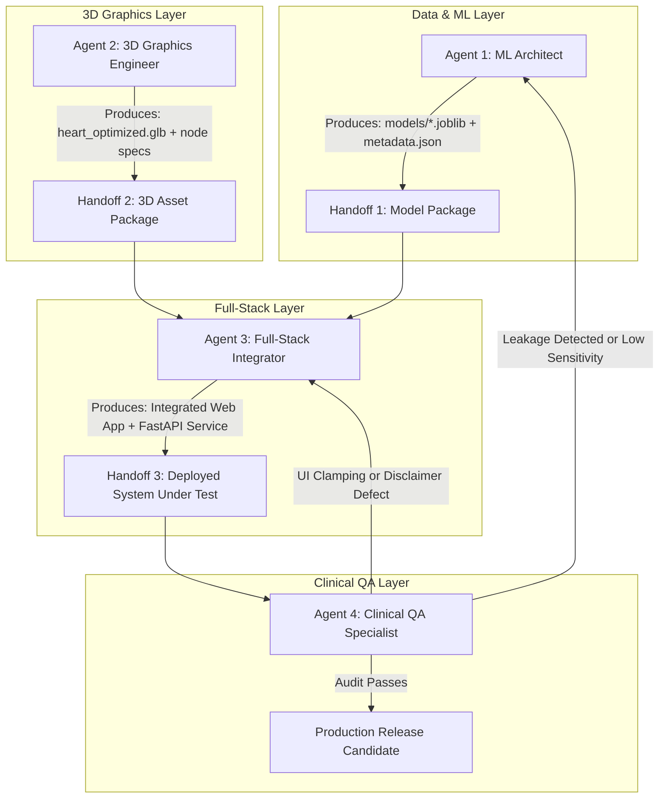

# Autonomous Agent Architecture: Perfusion3D
**Perfusion3D: Spatial Hemodynamic Ischemia & Coronary Twin (Track A: Multimodal AI Hackathon 2026)**
**Document Version:** 1.0.0 | **Status:** Approved Agent Role Specification

---

## 1. Overview & Multi-Agent Collaboration Model

The development, validation, and deployment of the Perfusion3D Clinical Platform is driven by four specialized functional roles (autonomous agents). Each agent is assigned distinct lifecycle responsibilities, strict invariants, specific toolsets, and formal handoff contracts.

```
┌────────────────────────────────────────────────────────────────────────────────────────┐
│                                 PROJECT LIFECYCLE                                      │
└────────────────────────────────────────────────────────────────────────────────────────┘
          │                                                    │
          ▼                                                    ▼
┌─────────────────────────────────┐                  ┌───────────────────────────────────┐
│     Agent 1: ML & Data          │                  │     Agent 2: 3D Graphics &        │
│          Architect              │                  │         WebGL Engineer            │
├─────────────────────────────────┤                  ├───────────────────────────────────┤
│ • Dataset ETL & Leakage Guard   │                  │ • Anatomical Mesh Normalization   │
│ • 4-Target Calibrated Boosters  │                  │ • glTF Node Rigging (LAD/LCX/RCA) │
│ • TreeSHAP Explainer Pipeline   │                  │ • Dynamic Risk Shaders (GLSL/R3F) │
└────────────────┬────────────────┘                  └─────────────────┬─────────────────┘
                 │                                                     │
                 │ Serialized Models & SHAP Explainer                  │ Optimized .GLB &
                 │ Feature Metadata                                    │ Node Hierarchy
                 ▼                                                     ▼
┌────────────────────────────────────────────────────────────────────────────────────────┐
│                              Agent 3: Full-Stack Integrator                            │
├────────────────────────────────────────────────────────────────────────────────────────┤
│ • FastAPI Production Endpoints (Pydantic v2 Contracts)                                 │
│ • Client State Synchronization (Zustand + TanStack Query)                              │
│ • Clinical HUD, Interactive Drawer, SHAP Waterfall & 3D Canvas Integration             │
└───────────────────────────────────────────┬────────────────────────────────────────────┘
                                            │
                                            │ End-to-End System Under Test
                                            ▼
┌────────────────────────────────────────────────────────────────────────────────────────┐
│                        Agent 4: Clinical Validation & QA Specialist                    │
├────────────────────────────────────────────────────────────────────────────────────────┤
│ • ROC-AUC / F1 / Brier Score Validation & Cross-Validation Audit                       │
│ • Adversarial Leakage Injection Testing ('Cath', 'LAD', 'LCX', 'RCA')                  │
│ • Physiological Input Boundary Stress Testing & SaMD Regulatory Disclaimer Enforcement │
└────────────────────────────────────────────────────────────────────────────────────────┘
```

---

## 2. Agent Specifications

### 2.1 Agent 1: Machine Learning & Data Architect

#### Role Definition & Persona
The **Machine Learning & Data Architect** is responsible for the integrity of the data pipeline, statistical validity, multi-target model training, probability calibration, and explainability extraction.

#### Primary Responsibilities
1. **Dataset Ingestion & Cleaning**: Ingest the UCI Extension of Z-Alizadeh Sani dataset ($N=303$), validating data types, clinical ranges, and missing value patterns.
2. **Absolute Target Leakage Prevention**: Programmatically guarantee that ground-truth catheterization findings (`Cath`) and target vessel stenosis outcomes (`CAD`, `LAD`, `LCX`, `RCA`) are never present in feature matrix $X$ during training, validation, or inference.
3. **Multi-Target Modeling**: Train four specialized gradient-boosted binary classifiers (`cad_model`, `lad_model`, `lcx_model`, `rca_model`) using LightGBM and XGBoost.
4. **Isotonic Probability Calibration**: Calibrate class posterior probabilities via `CalibratedClassifierCV` to ensure probabilities $P \in [0.0, 1.0]$ map accurately to biological risk.
5. **TreeSHAP Serialization**: Compile and serialize `shap.TreeExplainer` instances for instant real-time feature attribution generation.
6. **Artifact Packaging**: Export models, encoders, scalers, and feature metadata to `/models`.

#### Inputs & Outputs
- **Input Artifacts**: `data/raw/z_alizadeh_sani.csv`
- **Output Artifacts**:
  - `data/processed/X_features.parquet`
  - `data/processed/y_targets.parquet`
  - `data/processed/feature_metadata.json`
  - `models/cad_model.joblib`
  - `models/lad_model.joblib`
  - `models/lcx_model.joblib`
  - `models/rca_model.joblib`
  - `models/preprocessor.joblib`
  - `models/shap_explainers.joblib`
  - `models/model_metadata.json`

#### Invariants & Guardrails
- **INVARIANT ML-01 (Zero Leakage)**: The feature set $X$ must NEVER contain `cath`, `lad`, `lcx`, `rca`, or any string derivative thereof. A `DataLeakageException` must be raised if detected.
- **INVARIANT ML-02 (Leak-Free Cross-Validation)**: Imputation and scaling must strictly be fit within the training split of each Stratified K-Fold iteration.
- **INVARIANT ML-03 (Calibration)**: All predicted probabilities returned for 3D visualization must have a Brier score $< 0.18$.

---

### 2.2 Agent 2: 3D Graphics & WebGL Engineer

#### Role Definition & Persona
The **3D Graphics & WebGL Engineer** specializes in 3D asset optimization, WebGL/Three.js rendering pipelines, shader development, and real-time anatomical interaction within React Three Fiber.

#### Primary Responsibilities
1. **Mesh Normalization & glTF Hierarchy**: Ingest anatomical heart meshes, ensuring clean node hierarchies with exact semantic identifiers: `vessel_LAD`, `vessel_LCX`, `vessel_RCA`, and `myocardium`.
2. **Mesh Optimization & Draco Compression**: Run glTF-Transform to apply Draco geometry compression, prune unused vertex attributes, and optimize file size to $< 5\text{ MB}$.
3. **Dynamic Risk Shader & Material Management**:
   - Program reactive materials that continuously interpolate between healthy emerald (`#10B981`), borderline amber (`#F59E0B`), and critical crimson (`#EF4444`) based on stenosis probabilities.
   - Implement an oscillating emissive pulse shader for vessels with critical stenosis risk ($P > 0.75$).
4. **Camera Rig & Focal Animation**: Build smooth camera transitions using cubic lerping that focus on specific vessels when selected in the UI.
5. **WebGL Resource Lifecycle & Disposal**: Guarantee complete disposal of geometries, textures, and materials on component unmount to prevent GPU memory leaks.

#### Inputs & Outputs
- **Input Artifacts**: `assets/3d/raw/heart_anatomy_source.gltf`
- **Output Artifacts**:
  - `assets/3d/optimized/heart_coronary_optimized.glb`
  - `assets/3d/optimized/mesh_manifest.json`
  - `apps/web/src/components/3d/HeartCanvas.tsx`
  - `apps/web/src/components/3d/HeartModel.tsx`
  - `apps/web/src/components/3d/VesselMesh.tsx`
  - `apps/web/src/components/3d/CameraRig.tsx`

#### Invariants & Guardrails
- **INVARIANT 3D-01 (Semantic Node Naming)**: Meshes representing coronary arteries must be explicitly identified as `vessel_LAD`, `vessel_LCX`, and `vessel_RCA`.
- **INVARIANT 3D-02 (FPS Budget)**: The 3D scene must maintain a sustained 60 FPS on standard integrated GPUs (e.g., Intel Iris Xe / Apple M1) without requiring dedicated discrete GPUs.
- **INVARIANT 3D-03 (Zero Memory Leaks)**: Every Three.js `BufferGeometry`, `Material`, and `Texture` created must implement explicit `.dispose()` calls upon unmount.

---

### 2.3 Agent 3: Full-Stack Integrator

#### Role Definition & Persona
The **Full-Stack Integrator** bridges the ML inference services, 3D visualization canvas, and interactive clinical user interface, ensuring type safety, sub-50ms roundtrip response times, and an intuitive clinical UX.

#### Primary Responsibilities
1. **FastAPI Inference Endpoints**: Develop robust REST APIs (`/api/v1/predict`, `/api/v1/explain`, `/api/v1/health`) using FastAPI and Pydantic v2.
2. **Client State Management**: Architect Zustand stores for reactive UI state (active patient values, selected vessel focus, camera targets) and TanStack Query for caching inference requests.
3. **Clinical HUD & Input Drawer**: Build an interface featuring:
   - Patient biomarker sliders and sample presets (e.g., "Normal Screening", "High-Risk LAD Ischemia", "Triple Vessel CAD").
   - Vessel risk gauges displaying calibrated probabilities.
   - Interactive SHAP waterfall chart rendering localized feature attributions.
4. **Type Synchronization**: Enforce bidirectional TypeScript-to-Pydantic contract parity between `apps/api/app/schemas/` and `apps/web/src/types/`.

#### Inputs & Outputs
- **Input Artifacts**: Model checkpoints (`/models`), 3D components (`HeartModel.tsx`), Feature metadata (`feature_metadata.json`).
- **Output Artifacts**:
  - `apps/api/app/main.py`
  - `apps/api/app/schemas/*.py`
  - `apps/api/app/services/*.py`
  - `apps/web/src/App.tsx`
  - `apps/web/src/components/dashboard/*.tsx`
  - `apps/web/src/store/usePatientStore.ts`
  - `apps/web/src/types/clinical.ts`

#### Invariants & Guardrails
- **INVARIANT FS-01 (Type Safety)**: All network payloads must be validated by Pydantic v2 on the server and strictly typed via TypeScript interfaces on the client.
- **INVARIANT FS-02 (Real-Time Responsiveness)**: Input changes in the patient drawer must update the 3D vessel colors within $< 100\text{ ms}$.
- **INVARIANT FS-03 (Graceful Fallback)**: If the backend is unreachable, the frontend must display an informative banner and offer an offline mock mode for UI/3D evaluation.

---

### 2.4 Agent 4: Clinical Validation & QA Specialist

#### Role Definition & Persona
The **Clinical Validation & QA Specialist** enforces clinical safety, statistical soundness, metric thresholds, adversarial security against data leakage, and compliance with clinical decision-support standards.

#### Primary Responsibilities
1. **Statistical & Metric Verification**: Validate that all four classifiers meet cross-validated performance benchmarks:
   - Overall CAD: $\text{ROC-AUC} \ge 0.88$, $\text{Balanced Accuracy} \ge 0.80$
   - LAD Stenosis: $\text{ROC-AUC} \ge 0.82$, $\text{Sensitivity} \ge 0.80$
   - LCX Stenosis: $\text{ROC-AUC} \ge 0.75$, $\text{F1-Score} \ge 0.70$
   - RCA Stenosis: $\text{ROC-AUC} \ge 0.78$, $\text{Sensitivity} \ge 0.75$
2. **Adversarial Leakage Audit**: Execute automated test suites that attempt to inject `Cath`, `LAD`, `LCX`, `RCA`, and synonymous tokens into feature pipelines, verifying immediate pipeline rejection.
3. **Physiological Boundary Testing**: Test system robustness with edge-case and extreme clinical fixtures (e.g., Blood Pressure: 240/140 mmHg, Ejection Fraction: 15%, Troponin surges).
4. **Clinical Safety & Regulatory Disclaimers**: Verify that mandatory SaMD disclaimers are prominently displayed and cannot be permanently bypassed.

#### Inputs & Outputs
- **Input Artifacts**: API endpoints, Model checkpoints, Training logs, Web UI.
- **Output Artifacts**:
  - `apps/api/tests/test_leakage.py`
  - `apps/api/tests/test_inference.py`
  - `data/validation/test_cases_clinical.json`
  - `reports/validation_report.md`
  - `apps/web/src/components/common/DisclaimerModal.tsx`

#### Invariants & Guardrails
- **INVARIANT QA-01 (Mandatory Disclaimer)**: The application MUST render a non-dismissible or persistent clinical disclaimer stating: *"Decision support only. Not for primary clinical diagnosis or substitution of coronary angiography."*
- **INVARIANT QA-02 (Zero False Negative Tolerance in Testing)**: Safety audits must flag any hyperparameter configuration that produces a Sensitivity $< 0.75$ on the LAD artery due to high clinical risk of anterior wall infarction.

---

## 3. Inter-Agent Communication & Handoff Protocols



### Protocol Checklist for Deliverable Handoffs:
1. **Handoff 1 (ML $\rightarrow$ Full-Stack)**:
   - [ ] All 4 `.joblib` model files exist and load successfully.
   - [ ] `preprocessor.joblib` accepts a raw patient dictionary and returns clean numerical vectors.
   - [ ] `feature_metadata.json` specifies feature types, minimums, maximums, and default values.
2. **Handoff 2 (3D $\rightarrow$ Full-Stack)**:
   - [ ] `.glb` file size is under 5MB.
   - [ ] Mesh nodes `vessel_LAD`, `vessel_LCX`, and `vessel_RCA` exist in scene graph.
   - [ ] Materials accept color overrides via standard Three.js `MeshStandardMaterial`.
3. **Handoff 3 (Full-Stack $\rightarrow$ QA)**:
   - [ ] Backend runs on `http://localhost:8000` with Swagger docs at `/docs`.
   - [ ] Frontend runs on `http://localhost:5173` without console errors.
   - [ ] Changing input parameters updates both probability numbers and 3D colors.
4. **Handoff 4 (QA $\rightarrow$ Release)**:
   - [ ] `pytest` passes with 100% target leakage assertion tests.
   - [ ] Disclaimer modal verified on clean browser cache.
   - [ ] 60 FPS verified during continuous 3D rotation.
